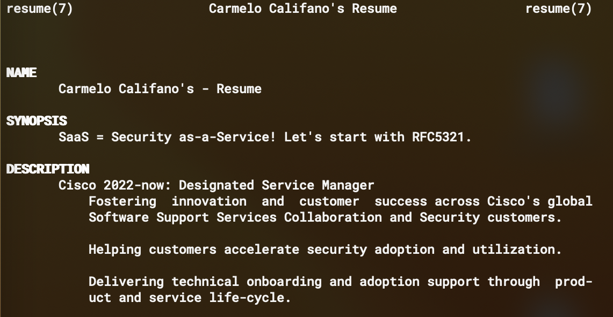

### Hello there!

<!--
**carmelo0x63/carmelo0x63** is a ✨ _special_ ✨ repository because its `README.md` (this file) appears on your GitHub profile.

Here are some ideas to get you started:

- 🔭 I’m currently working on ...
- 🌱 I’m currently learning ...
- 👯 I’m looking to collaborate on ...
- 🤔 I’m looking for help with ...
- 💬 Ask me about ...
- 📫 How to reach me: ...
- 😄 Pronouns: ...
- ⚡ Fun fact: ...

- 📫 Reach me through:
  - [LinkedIn](https://www.linkedin.com/in/carmelo/)
  - [Keybase](https://keybase.io/carmelo)
  - [GitHub](https://github.com/carmelo0x63)
    - [GitHub Pages](https://carmelo0x63.github.io/)
  - [GitLab](https://gitlab.com/carmelo0x63)
  - [Bitbucket](https://bitbucket.org/carmelo0x63/)
  - [Render](https://carmelo.onrender.com/)
  - [Docker Hub](https://hub.docker.com/u/carmelo0x63)
  - [Hachyderm.io](https://hachyderm.io/@carmelo)
  - [Mastodon.online](https://mastodon.online/@carmelo)
  - [Instagram](https://www.instagram.com/carmelo0x63/)
  - [Twitter](https://twitter.com/carmelo0x63)
  - [Reddit](https://www.reddit.com/user/carmelo0x99)
-->

<table border="0" width="100%">
  <tr>
    <td width="50%">
      You can stumble across me on:
      <ul>
        <li>Social sites</li>
          <ul>
            <li><a href="https://www.linkedin.com/in/carmelo/">LinkedIn</a></li>
            <li><a href="https://keybase.io/carmelo">Keybase</a></li>
            <li><a href="https://www.reddit.com/user/carmelo0x63">Reddit</a></li>
            <li><a href="https://carmelo0x63.bsky.social">BlueSky</a></li>
            <li><a href="https://mastodon.sdf.org/@carmelo">Mastodon</a></li>
           </ul>
        <li>Coding and other geeky sites</li>
          <ul>
            <li><a href="https://codeberg.org/carmelo">Codeberg</a></li>
            <li><a href="https://github.com/carmelo0x63">GitHub</a></li>
            <li><a href="https://gitlab.com/carmelo0x63/">GitLab</a></li>
            <li><a href="https://bitbucket.org/carmelo0x63/">Bitbucket</a></li>
            <li><a href="https://hub.docker.com/u/carmelo0x63">Docker Hub</a> (<a href="https://hub.docker.com/u/carmelo0x99">backup</a>)</li>
          </ul>
        <li>Good 'ol static pages</li>
          <ul>
            <li><a href="https://carmelo0x63.github.io/">GitHub Pages</a></li>
            <li><a href="https://zer0x63zer0x63.onrender.com/">Render</a></li>
            <li><a href="https://zer0x63zer0x63.pages.dev/">Cloudflare</a></li>
          </ul>
      </ul>
    </td>
    <td width="50%"></td>
  </tr>
</table>
<table border="0" width="100%">
  <tr>
    <th style="text-align:left">My resume</th>
  </tr>
  <tr>
    <td>
      
Cloud-native:

    </td>
  </tr>
  <tr>
    <td>
      <pre>$ docker run --rm carmelo0x63/resuman:latest</pre>
    </td>
  </tr>
  <tr>
    <td>
      
CLI style:

    </td>
  </tr>
  <tr>
    <td>
      <pre style="font-size: 10px">$ curl -sSLf https://raw.githubusercontent.com/carmelo0x63/carmelo0x63/main/carmelo.7 | groff -man -Tascii</pre>
    </td>
  </tr>
  <tr>
    <td>
      

    </td>
  </tr>
</table>
<table border="0" width="100%">
  <tr>
    <td width="20%">Tools 🔧 of my trade ➙</td>
    <td width="80%">
      <table border="1">
        <tr>
          <td>
            
OSs/Infrastructure

            
            
            
            
            
            
            
            
            
            
            
          </td>
        </tr>
        <tr>
          <td>
            
IaC

            
            
            
          </td>
        </tr>
        <tr>
          <td>
            
Coding

            
            
            
            
            
          </td>
        </tr>
        <tr>
          <td>
            
Databases

            
            
            
          </td>
        </tr>
        <tr>
          <td>
            
CI/CD

            
            
            
            
          </td>
        </tr>
        <tr>
          <td>
            
IoT

            
            
            
          </td>
        </tr>
      </table>
      
Made with <a href="https://simpleicons.org/">Simple Icons</a> and <a href="https://shields.io">Shields.io</a>.

    </td>
  </tr>
</table>

<!--START_SECTION:badges-->

<!--END_SECTION:badges-->

