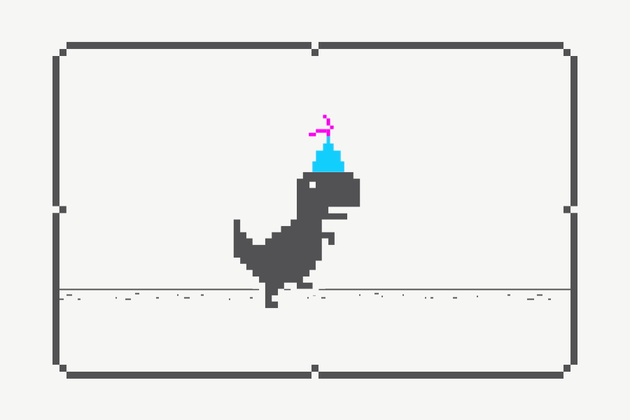

### Hi there 👋

<!--
**carmelo0x99/carmelo0x99** is a ✨ _special_ ✨ repository because its `README.md` (this file) appears on your GitHub profile.

Here are some ideas to get you started:

- 🔭 I’m currently working on ...
- 🌱 I’m currently learning ...
- 👯 I’m looking to collaborate on ...
- 🤔 I’m looking for help with ...
- 💬 Ask me about ...
- 📫 How to reach me: ...
- 😄 Pronouns: ...
- ⚡ Fun fact: ...

- 📫 Reach me through:
  - [LinkedIn](https://www.linkedin.com/in/carmelo/)
  - [Keybase](https://keybase.io/carmelo)
  - [GitHub](https://github.com/carmelo0x99)
    - [GitHub Pages](https://carmelo0x99.github.io/)
  - [Bitbucket](https://bitbucket.org/carmelo0x99/)
  - [Docker Hub](https://hub.docker.com/u/carmelo0x99)
  - [Twitter](https://twitter.com/carmelo0x99)
  - [Reddit](https://www.reddit.com/user/carmelo0x99)
  - [Instagram](https://www.instagram.com/carmelo0x99/)
-->

<table border="0">
  <tr>
    <td width="30%">
     <ul>
      <li>📫 Reach me through:</li>
       <ul>
        <li><a href="https://www.linkedin.com/in/carmelo/">LinkedIn</a></li>
        <li><a href="https://keybase.io/carmelo">Keybase</a></li>
        <li><a href="https://github.com/carmelo0x99">GitHub</a></li>
         <ul><li><a href="https://carmelo0x99.github.io/">GitHub Pages</a></li></ul>
        <li><a href="https://bitbucket.org/carmelo0x99/">Bitbucket</a></li>
        <li><a href="https://hub.docker.com/u/carmelo0x99">Docker Hub</a></li>
        <li><a href="https://twitter.com/carmelo0x99">Twitter</a></li>
        <li><a href="https://www.reddit.com/user/carmelo0x99">Reddit</a></li>
        <li><a href="https://www.instagram.com/carmelo0x99/">Instagram</a></li>
       </ul>
     </ul>
    </td>
    <td></td>
  </tr>
  </tr>
    <td width="30%">Tools 🔧 of my trade</td>
    <td>
      
      
      
      
    </td>
  <tr>
</table>

